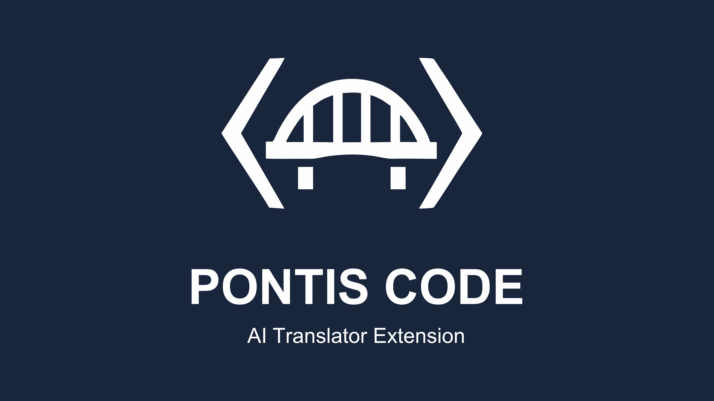
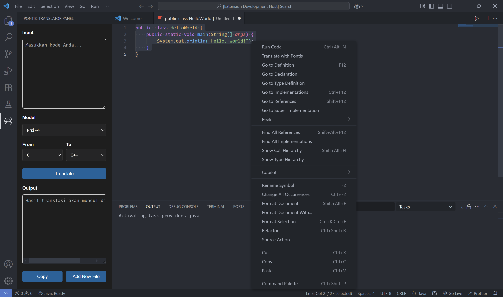

# Pontis Code: AI Translator

  

Pontis adalah ekstensi Visual Studio Code yang memungkinkan penerjemahan kode antar bahasa pemrograman menggunakan model pembelajaran mesin (LLM) open-source. Ekstensi ini dirancang untuk membantu pengembang, peneliti, dan mahasiswa dalam memigrasi, memahami, atau bereksperimen dengan berbagai bahasa pemrograman secara cepat dan interaktif.
  

---

## 🚀 Fitur Utama

- **Multi-Model Support**
  - Pilih dari berbagai model LLM terbaik seperti:
    - `microsoft/Phi-4-mini-instruct`
    - `deepseek-ai/deepseek-coder-6.7b-instruct`
    - `Qwen/Qwen2.5-Coder-7B-Instruct`
    - `Salesforce/codet5-base`
    - `uclanlp/plbart-base`

- **UI Panel Interaktif di Sidebar**
  - Input kode langsung.
  - Pilih model, bahasa sumber, dan target.
  - Lihat hasil terjemahan secara instan.

- **Tanpa Konfigurasi Tambahan**
  - Tidak memerlukan server lokal, API key, atau kredensial.

 

## 📚 Bahasa Pemrograman yang Didukung

Termasuk namun tidak terbatas pada:

- C, C++, CSharp, Dart, Go, Java, Javascript, Kotlin, PHP, Python, Ruby, Rust, Scala, Swift, Typescript

 

## 🧪 Contoh Kasus Penggunaan

- Migrasi proyek dari Java ke C#
- Eksperimen dan pembelajaran lintas bahasa

 

## 📦 Instalasi

1. Buka VS Code
2. Buka Extensions (`Ctrl+Shift+X`)
3. Cari **"Pontis Code"** dan klik install
4. Buka panel translator dari activity bar

  

 

## 🧭 Cara Penggunaan

Setelah instalasi berhasil, ikuti langkah-langkah berikut untuk menggunakan ekstensi **Pontis Code**:

1. **Buka Panel Pontis**  
   Klik ikon **Pontis** di *Activity Bar* (sidebar kiri) Visual Studio Code.

2. **Masukkan Kode**  
   - Tulis atau tempel potongan kode pada kolom input yang tersedia.  
   - Alternatif lainnya, pengguna dapat secara otomatis mengisi kolom input dari editor aktif dengan cara:
     - `Seleksi potongan kode di editor`
     - `Klik kanan`
     - `Pilih **"Translate with Pontis"** dari menu konteks`

3. **Pilih Model**  
   Gunakan dropdown untuk memilih model pembelajaran mesin yang ingin digunakan.

4. **Pilih Bahasa**  
   Tentukan bahasa sumber dan bahasa target dari dropdown yang tersedia.  
   > *Catatan:* Pilihan bahasa dapat bervariasi tergantung pada model yang digunakan.

5. **Klik Translate** 
   Proses translasi ditandai dengan indikator di status bar. Hasil akan muncul di area output setelah proses selesai.

6. **Tindakan Lanjutan**  
   - Klik tombol **"Copy"** untuk menyalin hasil translasi ke clipboard, atau  
   - Klik tombol **"Add New File"** untuk membuka hasil translasi di tab editor baru.

> ⚠️ *Pastikan koneksi internet aktif sebelum menjalankan proses translasi.*

 

## 🔒 Lisensi Model

Mohon diperhatikan bahwa setiap model memiliki lisensi yang berbeda:

| Model                                | Lisensi             |
|--------------------------------------|---------------------|
| microsoft/Phi-4-mini-instruct        | MIT License         |
| deepseek-ai/deepseek-coder-6.7b      | MIT License         |
| Qwen/Qwen2.5-Coder-7B-Instruct       | Apache 2.0 License  |
| Salesforce/codet5-base               | BSD-3 License       |
| uclanlp/plbart-base                  | MIT License         |

Pastikan untuk mematuhi ketentuan masing-masing lisensi dalam penggunaan dan distribusi.

 

## 🤝 Kontribusi

Kami terbuka untuk kontribusi!
- Laporkan bug
- Tambahkan dukungan bahasa baru
- Tingkatkan UX/UI panel translator

Repo tersedia di: [Potis Code Github](https://github.com/AlfaCodeFR/pontis-code)

 

## 💬 Kontak

Jika ada pertanyaan, saran, atau kolaborasi:
📧 Email: fathur.rasyid197@gmail.com
